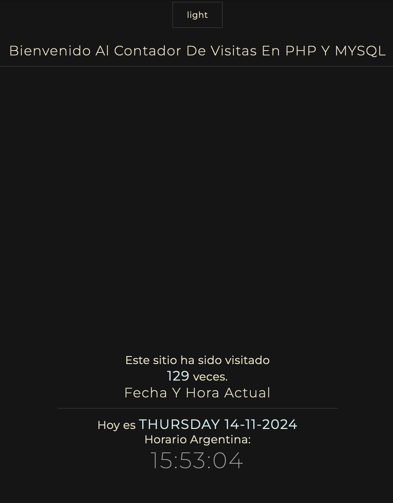

# Contador_Visitas

Este proyecto es una aplicación web simple creada en PHP y MySQL que permite llevar un contador de visitas y mostrar la fecha, día y hora actual en Argentina. La interfaz cuenta con un modo oscuro y tiene un diseño minimalista.

## Características

- **Contador de Visitas:** Muestra el número total de visitas al sitio.
- **Fecha y Hora:** Presenta la fecha, el día de la semana y la hora actual en tiempo real, según el huso horario de Argentina.
- **Modo Oscuro/Claro:** Botón en la parte superior para cambiar entre modo oscuro y claro (en la imagen, el botón dice "light" ya que está en modo oscuro).

## Estructura Visual

La interfaz incluye:
- Un saludo de bienvenida que dice: "Bienvenido A Mi Contador De Visitas".
- Un botón de cambio de tema para alternar entre modos oscuro y claro.
- La sección de **Fecha y Hora Actual**, que muestra:
  - Día de la semana, fecha completa y la hora actual.
  - Número de visitas en un mensaje como: "Este sitio ha sido visitado X veces".

## Tecnologías Utilizadas

- **PHP**: Utilizado para la lógica del backend, incluyendo el conteo de visitas y la obtención de la fecha y hora.
- **MySQL**: Base de datos donde se guarda el número de visitas.
- **HTML y CSS**: Para la estructura y diseño de la interfaz de usuario.

## Captura de Pantalla



## Instalación y Configuración

1. Clonar el repositorio: 
   ```bash
   git clone https://github.com/ImageDesignStudio/03_Contador_Visitas.git

